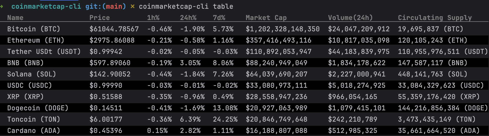
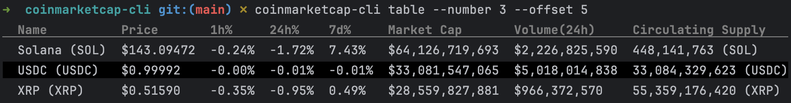

# coinmarketcap-cli
coinmarketcap-cli is a client that provides basic information about cryptocurrencies using public CoinMarketCap API

## Installation

```
go install github.com/GregEremeev/coinmarketcap-cli@latest
```

## Usage

```ssh
coinmarketcap-cli table
```


```ssh
coinmarketcap-cli table --number 3 --offset 5
```
